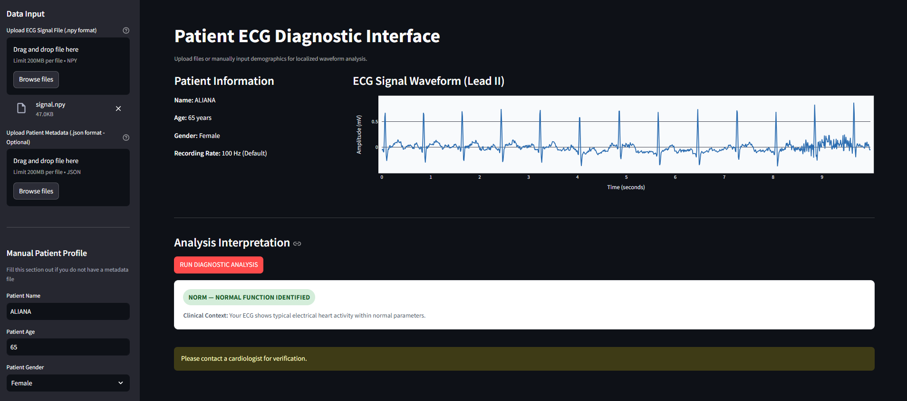

# Patient ECG Diagnostic Interface Portfolio

An interactive, light-themed Python dashboard built with Streamlit to visualize 12-lead ECG signals and perform localized cardiac multi-label classification using a PyTorch ResNet18 network architecture. 

The interface is engineered to operate entirely on-the-fly via web browser file uploads and runs efficiently on standard **CPU** hardware without requiring dedicated GPU acceleration.

---

## 📂 Repository Structure

To run this project locally, organize your folder in VS Code exactly like this:

```text
cardio/
│
├── README.md               # Project documentation (This file)
├── app.py                  # Main Streamlit user interface & layout orchestration
├── config.py               # Central configuration (thresholds, medical descriptions)
│
├── utils/
│   ├── __init__.py         # Package initialization marker
│   └── model_inference.py  # PyTorch model architecture, preprocessing, and CPU prediction pipeline
│
└── hierarchical_resnet_models/
    └── best_main_5class.pt # Trained model weights file (place here once training completes)


⚡ Key Dashboard Features
Drop-in File Uploads: Upload raw .npy signal arrays directly via browser file inputs.

Flexible Demographics Setup: Read profile details automatically from an uploaded .json metadata file, or type the patient's Name, Age, and Gender into manual entry forms on the fly.

Plotly Navigation Engines: Interact with high-fidelity, zoomable, and pannable waveform charts to inspect specific cardiac intervals.

Patient-Friendly Layouts: Translates raw decimal probabilities into clean, color-coded diagnostic status blocks containing descriptive context rather than confusing percentage numbers.

Safe Text Headers: Replaces traditional emoji markers with robust text badges to prevent rendering errors ([X] or broken glyph boxes) across different systems.

🚀 Installation & Setup
Follow these steps to configure your local workspace in VS Code:

Navigate to your workspace directory:
Open your terminal and change directories to your project folder:

Bash
cd E:/portfolio/cardio
Install core environment dependencies:
Ensure Python is installed on your system, then download the necessary visualization, processing, and deep learning framework layers via pip:

Bash
pip install streamlit plotly torch torchvision numpy pandas
Launch the local web server:
Boot up the dashboard panel on your system:

Bash
streamlit run app.py
Your default web browser will automatically open a tab loading the application interface (typically at http://localhost:8501).

💡 Runtime Execution Options
The dashboard is engineered with a smart fallback mechanism to allow design and workflow testing at any point in your project lifecycle:

Simulation Mode (Pre-Deployment): If you run the application while your models are still training on Kaggle, the backend seamlessly switches to a simulation baseline. You can fully test file uploads, type in manual demographics, and interact with the line charts right away without experiencing script crashes.

Production Mode (Post-Deployment): Once your Kaggle training pipeline finishes, download your best_main_5class.pt model checkpoint and place it inside the local ./hierarchical_resnet_models/ folder. The dashboard will automatically detect the file and transition from simulation over to live neural network predictions.

🚨 Disclaimer
This application is strictly designed for portfolio demonstration and experimental evaluation tracking. Diagnoses are processed locally by an automated algorithm and are not a substitute for professional clinical judgment. Please contact a cardiologist for official medical verification.****
